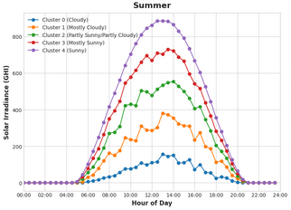
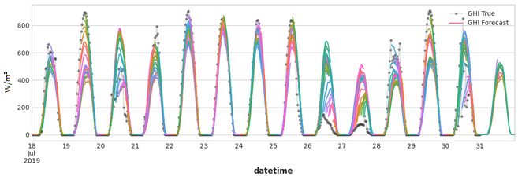
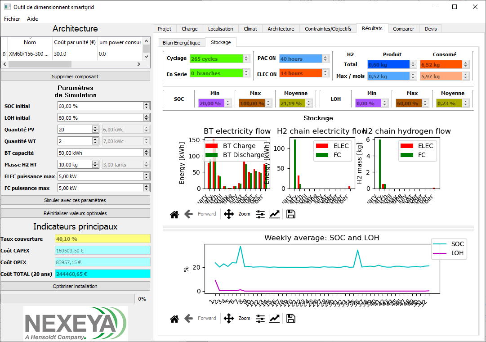

# Data Scientist
**Adrien GAUCHÉ**

⚡️ Ingénieur avec 4 ans d’expérience dans l’énergie électrique et l'hydrogène, j’ai enrichi mon profil en data science et optimisation durant ma thèse en entreprise.

🔭 Passionné par les données, je suis sérieux, analytique, adaptable et organisé. Apprécié pour mon ouverture aux autres, je suis prêt à relever de nouveaux défis professionnels dans le domaine de la data science.

## 📞 Références
- 📚 **Publications académiques** : [Voir mes publications sur HAL](https://cv.hal.science/adrien-gauche)
- 💼 **Profil LinkedIn** : [Visitez mon LinkedIn](https://www.linkedin.com/in/adrien-gauche/)
- 📫 **Contact** : adrien.gaucheCHEZcentraliens-nantes.org (remplacer "CHEZ" par @)
- 📑 **CV** : Disponible sur demande

## 🛠️ Compétences et Outils
- **Langages de programmation** : Python, SQL, C/C++, Julia
- **Analyse de données** : Pandas
- **Visualisation de données** : Seaborn, Streamlit
- **Apprentissage automatique** : Scikit-Learn, PyTorch
- **Explicabilité** : SHAP
- **Optimisation & Recherche Opérationnelle** :
  - Formulation Mixed-Integer Linear Programming (HiGHS, Gurobi...)
  - Heuristiques (Particle Swarm, algorithmes génétiques...)
- **Veille académique** : étude du besoin, formulation de la problématique à résoudre, état de l'art académique
- **Bases de données** : SQL, SQLite
- **Autres** : Git, Docker, Linux, Bash, Cronjobs

## 🏢 Expériences professionnelles
- **Ingénieur Data Science / Optimisation (CDD)**, [PowiDian Energy SAS](https://powidian.com/) | 2021 - 2024
- **Officier de Réserve EV2 (R)**, [Marine Nationale](https://jorfsearch.steinertriples.ch/name/Adrien%20Gauch%C3%A9) | 2020 - 2021
- **Ingénieur Études et Développement (Stage)**, [HENSOLDT NEXEYA France](https://www.hensoldt.fr/fr/ce-que-nous-faisons/energie/) | 2020

## 🎓 Éducation
- **Docteur en Génie Électrique (CIFRE)**, [Centrale Nantes](https://www.ec-nantes.fr/) | 2021 - 2024
- **Master Control in Smartgrids and Distributed Generation**, [UPV / EHU](https://www.ehu.eus/en/web/master/master-control-in-smartgrids), Espagne | 2019 – 2020
- **Ingénieur Diplômé**, [ESTIA](https://www.estia.fr/) | 2017 - 2020

# 📊 Portfolio Data Science

Voici quelques projets réalisés durant ma formation et sur mon temps personnel.

## 🌞 Prédiction de l'ensoleillement à l'échelle de la journée pour la gestion d'énergie

Création d'un modèle de prédiction de l'ensoleillement pour anticiper la génération électrique solaire. Les prédictions sont fournis à un modèle d'optimisation de la gestion d'énergie (*unit commitment*) [Voir le projet sur Kaggle](https://www.kaggle.com/code/adri1g/predict-solar-irradiance)

*Régression / Feature Engineering / Hyper-paramètres / Clustering / Réduction de Dimension / Gradient Boosting*

### Données
Séries temporelles (irradiance, température, vent, angle zénithal du soleil...) mesurées par satellite sur 3 ans avec un pas de temps de 15 minutes (open data NSRDB).

### Démarche
- Analyse exploratoire et étude des caractéristiques statistiques (information mutuelle, corrélation)
- Feature Engineering : création de variables à partir de la littérature académique
- Clustering : détermination de la couverture nuageuse
- Réduction de dimension (PCA) des données météo
- Comparaison et sélection des features
- Comparaison de plusieurs modèles de régression (Lasso, ElasticNet, Random Forest, XGBoost, LightGBM, MLP Neural Network...)
- Détermination de la quantité de données nécessaire
- Optimisation des hyper-paramètres
- Explication du modèle (SHAP)

### Résultats
- Random Forest Regression rapide à inférer
- Prédiction de l'ensoleillement pour les 24 heures à venir par pas de temps de 30 minutes
- Erreur RMSE moyenne de 94,3 W/m²

---

# Développement logiciel

## 🔋 Logiciel de dimensionnement de microréseau électrique

Création, à partir de zéro, d'un logiciel de simulation et de dimensionnement de microréseau avec génération renouvelable et stockage hydrogène. Conçu durant mon stage de fin d'études en 2020, ce logiciel est toujours en utilisation.

*Série temporelle / Architecture logicielle UML / Dashboard Qt5 / Visualisation de données*

### Données
Séries temporelles de mesures d'ensoleillement, de vent et de consommation électrique

### Démarche
- Étude des besoins utilisateurs
- État de l'art académique
- Conception (UML) et implémentation (Python)
- Création de l'interface graphique en Qt 5
- Travail collaboratif avec gestion de version Git
- Déploiement de l'application en .exe avec PyInstaller
- Rédaction de la documentation et formation des utilisateurs

### Résultats
- Application graphique pour simuler et dimensionner les moyens de génération et de stockage d'un microréseau, utilisée par le service offre.

## 📡 Logiciel de mesures du spectre radio

Développement d'un outil de mesures précises de la puissance des canaux adjacents (*Adjacent channel power* : ACP) pour évaluer les interférences radio sur les canaux auxiliaires des radios en sortie d'usine.

*Conception logicielle UML / C++ / Bash Linux*

- Définition des besoins utilisateurs 
- Mise à jour de l'architecture logicielle (UML)
- Implémentation en C++ et Qt5
- Mise à jour des scripts Bash (Linux)
- Tests utilisateurs